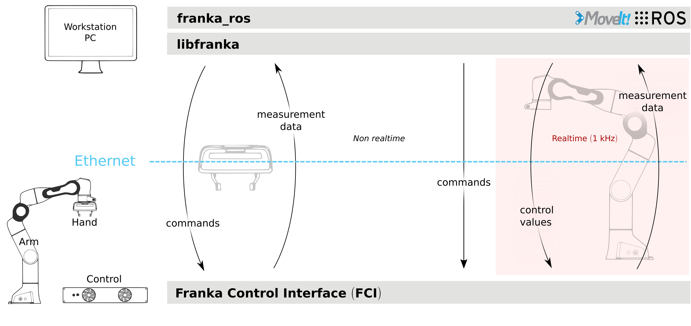
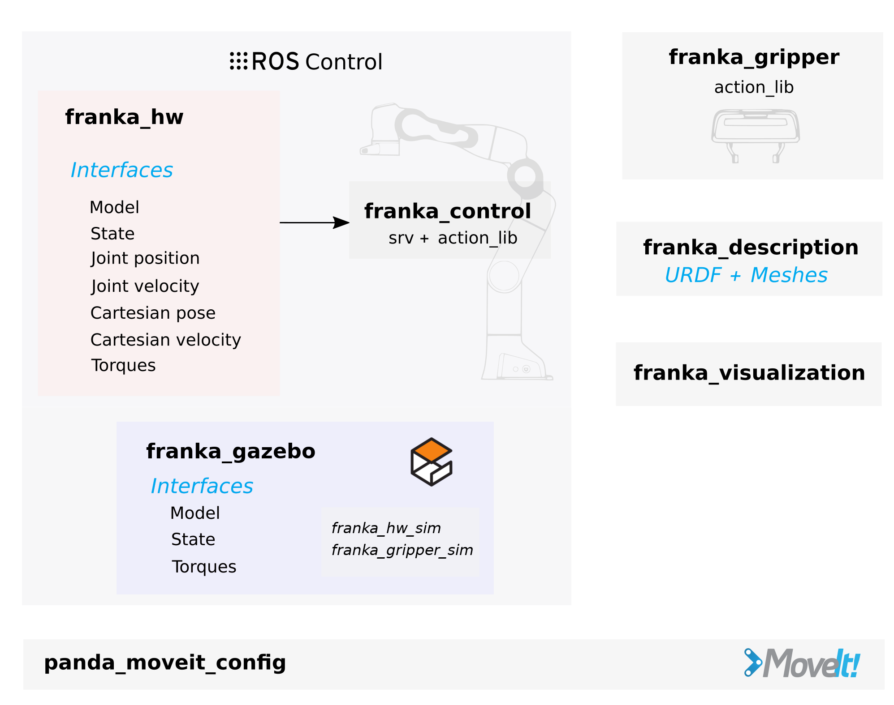

# Franka Emika Research Robotic Arm

# Hardware Architecture

limits and features and stuff
https://frankaemika.github.io/docs/control_parameters.html#limits-for-panda

# Software Architecture
- The Franka Control Interface (FCI) allows a fast and direct low-level bidirectional connection to the Arm and Hand. It provides the current status of the robot and enables its direct control with an external workstation PC connected via Ethernet.
- FCI is on the controller level and its only prequisite is rt kernel
- FCI can be controlled through the low-level open-source libfranka library which could in turn be controlled through high-level open-source ros_franka library.
- 1KHZ
- While the FCI is active you have full, exclusive control of the Arm and Hand. This means that you cannot use Desk or Apps at the same time as the FCI.
- Network Connection to the arm via ip
    - workstation pc: 172.16.0.1
    - control: 172.16.0.2 (same as `<fci-ip>`)

## `libfranka` : Low-level Control C++ Library

### Features

- Interfaces (realtime & non-realtime commands):
    - Gravity & friction compensated joint level torque commands.
    - Joint position or velocity commands.
    - Cartesian pose or velocity commands.

- Measurements:
    - Measured joint data, such as the position, velocity and link side torque sensor signals.
    - Estimation of externally applied torques and forces.
    - Various collision and contact information.

- The robot model library:
    - Forward kinematics of all robot joints.
    - Jacobian matrix of all robot joints.
    - Dynamics: inertia matrix, Coriolis and centrifugal vector and gravity vector.

- Examples:
    - To execute the examples, or possibly other programs, navigate to `<home>/libfranka/build/examples/`. Then, you can use run: `./<example-file> <fci-ip>`
    - For list of examples: https://frankaemika.github.io/libfranka/examples.html
    - To verify robot connection and get current joint state: `./echo_robot_state 172.16.0.2`

## `franka_ros` : ROS & moveit Integration

### Features

- Integrates libfranka into ROS Control. 
- Includes URDF models and detailed 3D meshes of our robots and end effectors, which allows visualization (e.g. RViz) and kinematic simulations. 
- MoveIt! integration makes it easy to move the robot and control the gripper, and the provided examples show you how to control your robot using ROS.

### Interfaces

TODO

## `panda_moveit_configs` : moveit examples for franka panda

### Features

TODO

### Interfaces

TODO

# Resources

- https://frankaemika.github.io/docs/index.html
- https://frankaemika.github.io/docs/control_parameters.html#limits-for-panda
- https://github.com/frankaemika/libfranka
- https://frankaemika.github.io/libfranka/
- https://wiki.ros.org/franka_ros
- https://github.com/frankaemika/franka_ros
- https://moveit.ros.org/documentation/concepts/